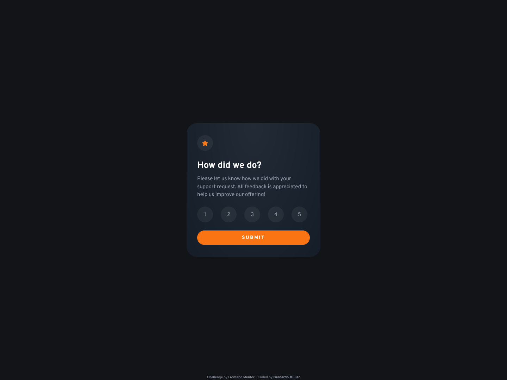

# Frontend Mentor - Interactive rating component

## The challenge

Your challenge is to build out this interactive rating component and get it looking as close to the design as possible.

You can use any tools you like to help you complete the challenge. So if you've got something you'd like to practice, feel free to give it a go.

Your users should be able to:

- View the optimal layout for the app depending on their device's screen size
- See hover states for all interactive elements on the page
- Select and submit a number rating
- See the "Thank you" card state after submitting a rating

### Screenshot

### Links

- Live Site URL: [Live Site URL](https://interactiveratingcomponent.netlify.app/)

## My process

- HTML Basics
- CSS Layout
- Work on the Javascript
- Finish Layout and Responsiveness
- Test everything

### Built with

- Semantic HTML5 markup
- CSS custom properties
- Flexbox
- CSS Grid
- Mobile-first workflow
- [Sass](https://sass-lang.com/)
- [BEM](http://getbem.com/naming/)

### What I learned

- Radial gradient background
- More javascript practice
- Easy hidden elements toggle

### Continued development

- I need a lot more javascript fundamental knowledge
- Still have a bug in the code that I could not fix
